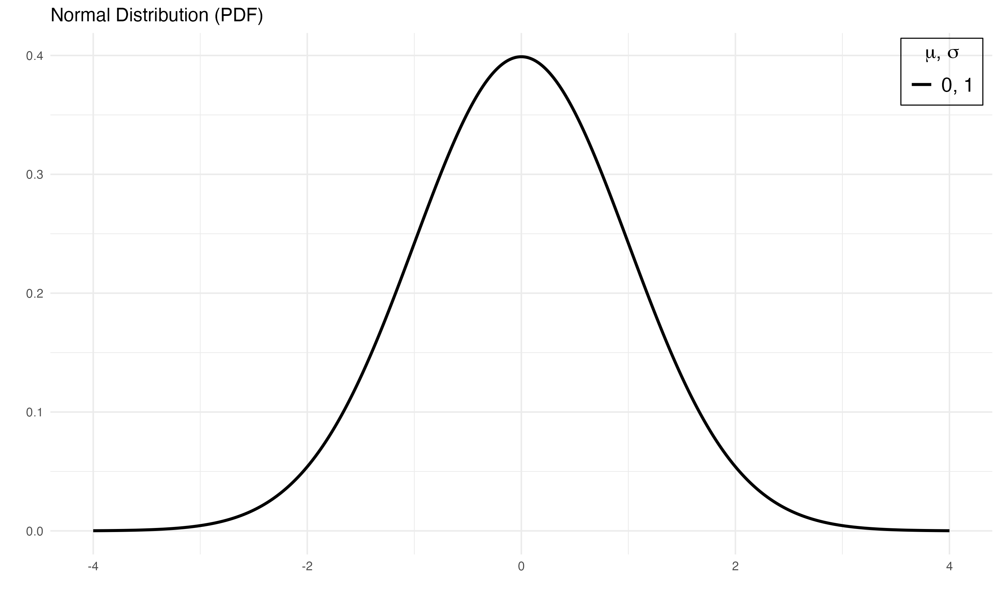

# pdplot2 

This package contains a simple wrapper function, `pdplot2` which visualizes probability density/mass functions provided in the base `R` using [ggplot2](https://ggplot2.tidyverse.org). The available probability density/mass functions include the following: `normal`, `logistic`, `binomial`, `chi-square`, `poisson`, `exponential`, `cauchy`, `beta`, `gamma`, `geometric`, `Student's t` and `F`.

## Installation

``` r
install.packages(devtools)
devtools::install_github("tegedik/pdplot2")
```

## Usage

`pdplot2` follows the convention of density distributions in `R`. First you need to create a vector of quantiles and pass it as the first argument in the function. Then, you need to select the correct parameter(s) for each distribution. Finally, you need to enter the `type` of the distribution. Here is an example with normal distribution,

``` r
pdplot2(seq(-4, 4, 0.01), mean=0, sd=1, type="normal")
```



This will create a normal probability distribution with `mean` 0 and `sd` 1. You can pass vector of parameter values as argument to plot multiple density curves.  

``` r
pdplot2(seq(-5, 5, 0.01), mean=c(0,0), sd=c(1,2), type="normal")
```


Here is an example with binomial distribution,

``` r
pdplot2(0:25, size=c(20, 30), prob=c(0.4, 0.5), type="binomial")
```


## Changing Linetypes

You might want to change the default linetypes. After setting `line.selection=TRUE`, you can pass a character vector to `linetype` to change them. 

``` r
pdplot2(0:20, lambda=6:9, type="poisson", line.selection=TRUE, 
        linetype=c("solid", "dashed", "dashed", "dashe"))
```


## Showing and Changing Colors

You might also prefer colored plots. To show colors instead of linetypes, you need to specify `show.color=TRUE`.

``` r
pdplot2(seq(-5, 5, 0.01), mean=c(0,0,0), sd=c(1,1.5,2), type="normal", show.color=TRUE)
```


As in the case of linetypes, you can change colors. In addition to `show.color=TRUE`, you need to set `color.selection=TRUE`, and then pass a character vector to `color`.

``` r
pdplot2(seq(-5, 5, 0.01), mean=c(0,0,0), sd=c(1,1.5,2), type="normal", 
        show.color=TRUE, color.selection=TRUE, color=c("black", "blue", "green"))
```


## References

Guangchuang Yu (2020). hexSticker: Create Hexagon Sticker in R. R package version 0.4.9. https://CRAN.R-project.org/package=hexSticker
  
H. Wickham. ggplot2: Elegant Graphics for Data Analysis. Springer-Verlag New York, 2016.
  
Karthik Ram and Hadley Wickham (2018). wesanderson: A Wes Anderson Palette Generator. R package version 0.3.6. https://CRAN.R-project.org/package=wesanderson
