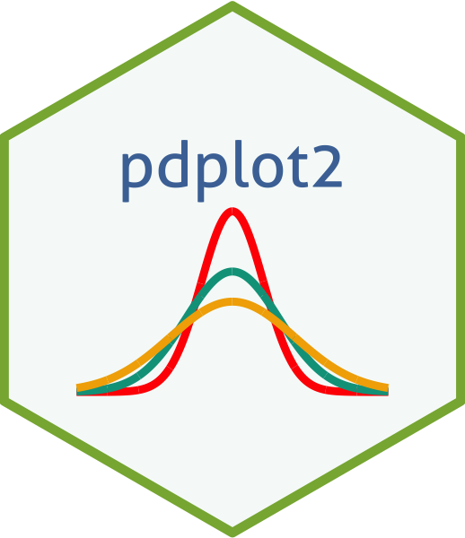
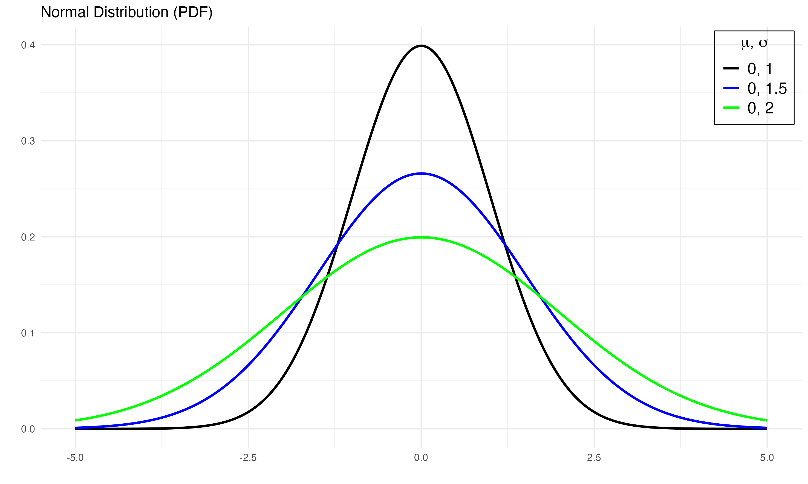

# pdplot2 

This package contains a simple wrapper function, `pdplot2` which visualizes probability density/mass and cumulative distribution functions provided in the base `R` using [ggplot2](https://ggplot2.tidyverse.org). The available PDFs & CDFs include the following: `normal`, `logistic`, `binomial`, `chi-square`, `poisson`, `exponential`, `cauchy`, `beta`, `gamma`, `geometric`, `Student's t`, `F`, `Weibull`, `negative binomial`, `log-normal`, `uniform`, and `hypergeometric`.

## Installation

``` r
install.packages(devtools)
devtools::install_github("tegedik/pdplot2")
```

## Usage

`pdplot2` follows the convention of density distributions in `R`. First, you need to create a vector of quantiles and pass it as the first argument in the function. Then, you need to select the correct parameter(s) for each distribution (e.g., `mean`, `sd`). Afterwards, you need to specify the probability distribution (e.g., `dist="normal"`). Finally, you choose between probability density or cumulative distribution functions (e.g., `type="PDF"`). Here is an example with normal distribution,

``` r
pdplot2(seq(-4, 4, 0.01), mean=0, sd=1, dist="normal", type="PDF")
```


This will create a normal probability distribution with `mean` 0 and `sd` 1. You can pass vector of parameter values as argument to plot multiple density curves.  

``` r
pdplot2(seq(-5, 5, 0.01), mean=c(0,0), sd=c(1,2), dist="normal", type="PDF")
```


If you use `type="CDF"`, the function will return a cumulative distribution function:

``` r
pdplot2(seq(-5, 5, 0.01), mean=c(0,0), sd=c(1,2), dist="normal", type="CDF")
```


## Changing Linetypes

You might want to change the default line types. To accomplish this, you can pass a character vector containing types to `linetype`.

``` r
pdplot2(0:20, lambda=6:9, dist="poisson", type="PDF",
        linetype=c("solid", "dashed", "dashed", "dashed"))
```


## Colors

You might also prefer colored plots. To show colors instead of linetypes, you need to specify `show_color=TRUE`.

``` r
pdplot2(seq(-5, 5, 0.01), mean=c(0,0,0), sd=c(1,1.5,2), dist="normal", type="PDF", show_color=TRUE)
```


As in the case of line types, you can change colors. You need to set `color_selection=TRUE` and then pass a character vector to `color`.

``` r
pdplot2(seq(-5, 5, 0.01), mean=c(0,0,0), sd=c(1,1.5,2), dist="normal", type="PDF",
              show_color=TRUE, color=c("black", "blue", "green"))
```



## Editing Plots

Since `pdplot2` runs `ggplot2` and creates `ggplot2` objects, you can edit plots using `ggplot2` functions. For example, after plotting discrete distributions, you might want to add points (see this [wiki page](https://en.wikipedia.org/wiki/Poisson_distribution) for Poisson distribution). 

``` r
pdplot2(0:20, lambda=c(1,4,10), dist="poisson", type="PDF", show_color=TRUE) + geom_point(size=4)
```


## References

Guangchuang Yu (2020). hexSticker: Create Hexagon Sticker in R. R package version 0.4.9. https://CRAN.R-project.org/package=hexSticker
  
H. Wickham. ggplot2: Elegant Graphics for Data Analysis. Springer-Verlag New York, 2016.
  
Karthik Ram and Hadley Wickham (2018). wesanderson: A Wes Anderson Palette Generator. R package version 0.3.6. https://CRAN.R-project.org/package=wesanderson
